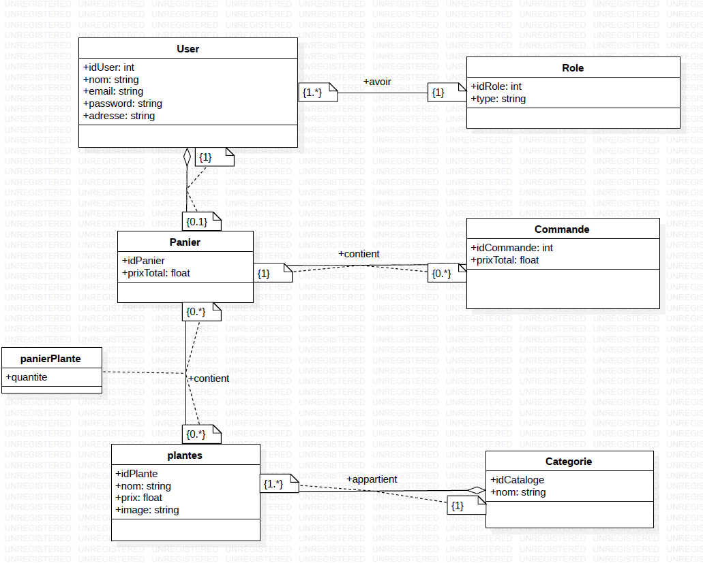

# O'PEP

## Aperçu du projet

Ce projet consiste à construire un site web pour une pépinière O'PEP en utilisant PHP, avec l'objectif de le rendre facile à utiliser pour tout le monde

## Principaux liens

### 1. Tableau Jira

Visitez notre tableau Jira pour suivre l'évolution du projet et des tâches.: [O'PEP](https://bouanani-soufiane.github.io/Brief-MUCEM/)

### 2.Présentation

Découvrez les détails sur notre présentation Canva : [O'PEP](https://bouanani-soufiane.github.io/Brief-MUCEM/)

### Les diagrammes UML

| diagramme de classe      |
| ------------------------ |
|  |

| diagramme de cas d'utilisation                   |
| ------------------------------------------------ |
|  |

| diagramme de séquence |
| --------------------- |
|         |
